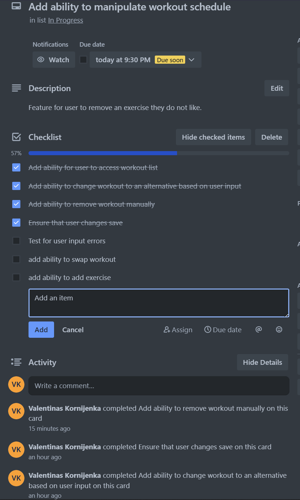

# T1A3 Workout Generator
## Valentinas Kornijenka

### [Link to Git Repository](https://github.com/ValK-98/terminal-application)

### [Link to Trello Board](https://trello.com/invite/b/Daeh2XCJ/ATTI30c12f9eab2e0701832223734b0013b670446B23/t1a3-terminal-application)

## Styling guide

For this project I used the PEP8 Style Guide - [ which you can find here](https://peps.python.org/pep-0008/).

## Features of app


### Feature 1: Generation of a workout schedule based on days and goal

When the app is run - the user gets asked if they would like to create a workout schedule, it'll ask the user their goal which is either strength gain or muscle gain. Then, it will ask the user the amount of days that they would like to train. It will then output a workout plan for the user based on the parameters. The app also considers the amounts of accessory and compound movements. If the user only picks one day of working out then the app generates a plan with exclusively compound movements. Otherwise, the app limits 1 compound movement per session, additionally not repeating throughout the week. It also balances the exercises to be evenly balances throughout the week. 


### Feature 2: Ability to customize workouts by adding, swapping and deleting exercises

After the workout plan is generated, there is an options menu that the user can interact with that will let them manipulate the workout plan. They can pick to add an exercise to a specific day and pick if they would like a compound or accessory movement as well as the body part they would like to work. Alternatively, they can pick to remove a specific exercise from the plan. Or, if they desire - they can swap exercises with either the same body part worked or a different one of their choosing. 


### Feature 3: Ability to export workout to a text file

Finally, the app will let the user export the workout plan to a text file with the name of which they're free to manipulate or just leave the default one. 

## Implementation plan


### Trello board screenshots





## Code Walkthrough


### Feature 1: Generation of a workout schedule based on days and goal

1. *Prompt User for Input:*

* Ask the user to specify which day's workout they'd like to view. Offer them the option to view all days.

2. *Retrieve Workout Data:*

* If one day is chosen, display only compound movements.
* If more than one day is chosen, display both compound and accessory movements.

3. *Format and Display Data:*

* Present the retrieved data in an easy-to-read format, listing days, exercises, sets, reps, and body parts.

4. *Error Handling:*

*  If the user inputs an invalid day or input, provide an error message and prompt them to input again.


### Feature 2: Ability to customize workouts by adding, swapping and deleting exercises

1. *Present Customization Options:*

* Display options like add, swap, or delete exercises to the user.

2. *Execute Chosen Customization:*

* Add Exercise:

  * Ask the user which day to add to.
  * Ask for the body part and exercise type.
  * Find available exercises and add the selected one to the workout.
  * Notify the user about the addition.


* Swap Exercise:

  * Ask the user which day and which exercise they'd like to swap.
  * Get the replacement exercise's body part and type.
  * Replace the old exercise with the new one.
  * Notify the user about the swap.


* Remove Exercise:

  * Ask the user to select the day and exercise they want to remove.
  * Remove the specified exercise from the workout.
  * Notify the user about the deletion.


3. *Update Workout Schedule:*

* After any customization, ensure that the workout schedule is updated with the new changes.

4. *Error Handling:*

*  If the user inputs an invalid day or input, provide an error message and prompt them to input again.


### Feature 3: Ability to export workout to a text file

1. *Retrieve Workout Data:*

*  Fetch the generated workout plan.

2. *Create and Write to Text File:*

* Using the provided filename or the default, create a new text file (or overwrite if the file already exists).

* Write the formatted workout data to the text file.

3. *Notify User of Successful Export:*

* Once the data is successfully written to the text file, provide a message to the user confirming the export.

## Help Documentation


### System/Hardware requirements:

- Modern Operating System:
    - Windows 7 or 10
    - Mac OS X 10.11 or higher, 64-bit
    - Linux: RHEL 6/7, 64-bit (almost all libraries also work in Ubuntu)
- 4 GB RAM
- 5 GB free disk space
- Python 3.10 or higher

 *Source: [Entought](https://support.enthought.com/hc/en-us/articles/204273874-Enthought-Python-Minimum-Hardware-Requirements)*

### Required dependencies:

```
black==23.10.0
click==8.1.7
exceptiongroup==1.1.3
Faker==19.12.0
iniconfig==2.0.0
mypy-extensions==1.0.0
numpy==1.26.1
packaging==23.2
pathspec==0.11.2
platformdirs==3.11.0
pluggy==1.3.0
pytest==7.4.3
python-dateutil==2.8.2
six==1.16.0
tomli==2.0.1
typing_extensions==4.8.0

```

### Installation process:

1. First, ensure that you have Python 3.0 installed. You can check this by using the `python --version` command inside of the terminal. If you don't have Python 3.0 installed, you can download it from the official [python website](https://www.python.org/downloads/).

2. Your system should also support pip, if it doesn't you can download it from the [following](https://pip.pypa.io/en/stable/installation/).

3. Clone the depository and go into it:

```bash

git clone https://github.com/ValK-98/terminal-application.git

cd terminal-application/src

```

4. Install dependencies:

```bash

pip install -r requirements.txt

```

5. Execute the script with the following: 

```bash 

chmod +x workout_generator.sh

./workout_generator.sh

```

## How to use application:


Using the app is quite straightforward. Upon launch, the application will ask you for the number of days you'd like to work in a week as well as your workout goal. 
Then, it will display the generated workout. 
You're able to manipulate the workout further by entering the corresponding numbers. E.g. Type `1` to go into the Remove workout feature. 


